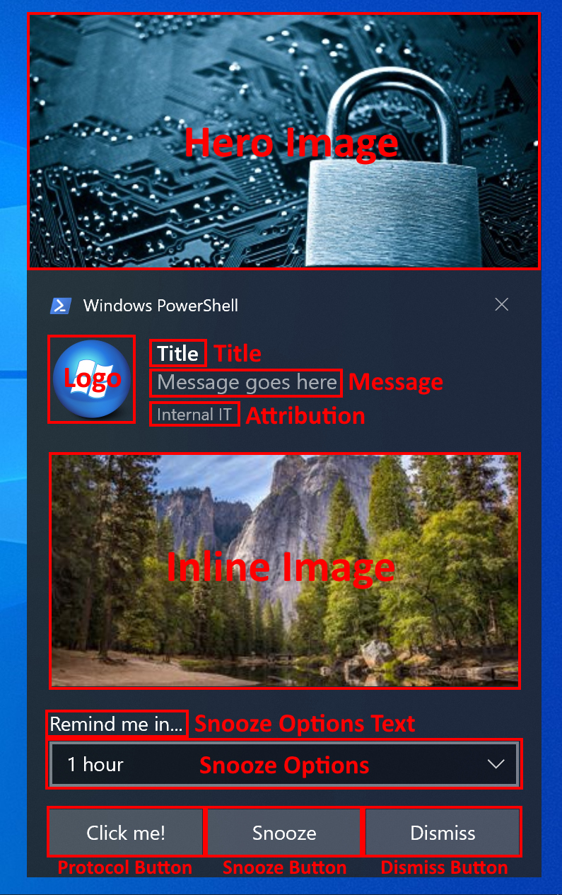

# Simple Toast Notification

## Table of Contents
- [Why another Toast Notification Script?](#Why-another-toast-notification-script?)
- [Which versions of PowerShell are supported?](#Which-versions-of-PowerShell-are-supported?)
- [What functionality does the script support](#What-functionality-does-the-script-support?)
  - [Things to note](#Things-to-note)
- [How to use the script](#How-to-use-the-script)
- [How does the script show a notification when run as 'System'?](#How-does-the-script-show-a-notification-when-run-as-'System'?)

## Why another toast notification script?
Simple Toast Notification was born from the need for a basic notification script that could be called from an Endpoint Manager/Intune Remediation script, which may be running in either user or system context and still be able to show the user a toast notification. While there are other excellent Toast Notification scripts and modules available, they all do far more than was needed. Two such projects are linked below, and both are worth checking out if you need more functionality or inspiration.

https://github.com/Windos/BurntToast
https://github.com/imabdk/Toast-Notification-Script

## Which versions of PowerShell are supported?
While Endpoint Manager/Intune run the scripts as Windows PowerShell 5.1, this script has been tested with both:

Windows PowerShell 5.1
PowerShell 7

## What functionality does the script support?
Currently the following options are supported

* Hero image
* Logo override
* Title
* Message
* Single inline image
* Attribution Text
* A Protocol Button, e.g. a link to a website or file with optional custom text
* A dismiss button

### Things to note

1. Due to the way the script works, you will find quotes in your messages are stripped. If you need to use them, substitute them with ## and they will automatically be replaced with ". For example, `This is a "message"` should be written as `This is a ##message##`

## How to use the script
To get started with an example notification simply run:

`.\toast.ps1`

To display a notification with a custom title and message run:

`.\toast.ps1 -title "This is my title" -message "This is my first full message"`

For all the possible parameters please see the script header.

## How does the script show a notification when run as 'System'?
If the script detects it is running as 'System', it will attempt to create and then run two new files. The first file is `runAsUser.ps1` that uses some magic .NET (borrowed from https://github.com/imabdk/Toast-Notification-Script) to call a second file `hidePS.vbs` as the logged on user, which in turn calls the original PowerShell script with all of the same parameters, thus allowing the notification to be seen by the user. 

If you're wondering why there is an old fashioned VBScript thrown in, it's not just for fun. When you launch a PowerShell script in the user's context they will briefly see a PowerShell window popup, even if it has the `hidden` parameter. Why Microsoft do this I don't know, but I do know if you call the PowerShell script from a VBScript it is fully hidden.